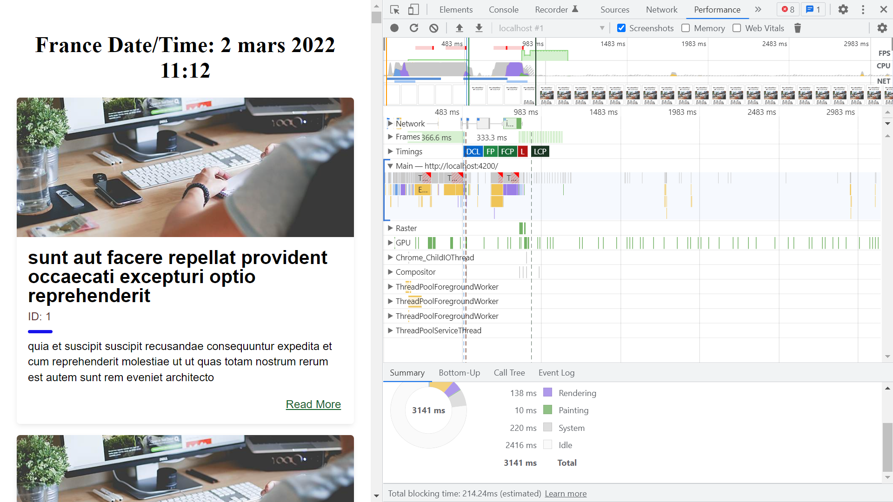

# :zap: Angular WebPack SPA Example

* Angular App to display international time & make calls to an external [JSON placeholder API](https://jsonplaceholder.typicode.com/).

*** Note: to open web links in a new window use: _ctrl+click on link_**

## :page_facing_up: Table of contents

* [:zap: Angular WebPack SPA Example](#zap-angular-webpack-spa-example)
  * [:page_facing_up: Table of contents](#page_facing_up-table-of-contents)
  * [:books: General info](#books-general-info)
  * [:camera: Screenshots](#camera-screenshots)
  * [:signal_strength: Technologies](#signal_strength-technologies)
  * [:floppy_disk: Setup](#floppy_disk-setup)
  * [:computer: Code Examples](#computer-code-examples)
  * [:cool: Features](#cool-features)
  * [:clipboard: Status & To-Do List](#clipboard-status--to-do-list)
  * [:clap: Inspiration](#clap-inspiration)
  * [:envelope: Contact](#envelope-contact)

## :books: General info

* [jsonplaceholder.typicode.com](https://jsonplaceholder.typicode.com/) used for API data
* More about webpack:

1. Webpack is a module bundler, but you can also use it for running tasks as well.
2. Webpack relies on a dependency graph underneath. Webpack traverses through the source to construct the graph, and it uses this information and configuration to generate bundles.
3. Webpack relies on loaders and plugins. Loaders operate on a module level, while plugins rely on hooks provided by webpack and have the best access to its execution process.
4. Webpack’s configuration describes how to transform assets of the graphs and what kind of output it should generate. Part of this information can be included in the source itself if features like code splitting are used.
5. Hot Module Replacement (HMR) helped to popularize webpack. It's a feature that can enhance the development experience by updating code in the browser without needing a full page refresh.
6. Webpack can generate hashes for filenames allowing you to invalidate past bundles as their contents change.

## :camera: Screenshots

.

## :signal_strength: Technologies

* [Angular v13](https://angular.io/)
* [RxJS Library v7](https://angular.io/guide/rx-library) and makeCall() function used to consume API data [observable](http://reactivex.io/documentation/observable.html).
* [Webpack v5](https://webpack.js.org/) is used to bundle scripts.

## :floppy_disk: Setup

* Run app using `ng serve to start the compiled build file.
* Navigate to `http://localhost:4200/`.
* `npm run build` to create build folder.
* `npm run build:sm` to create build folder with source map files

## :computer: Code Examples

* `echo.service.ts` to fetch API data

```typescript
public makeCall(): Observable<any> {
		return this.httpClient.get<any>(
			'https://jsonplaceholder.typicode.com/posts'
		).pipe(
      take(1)
    );
	}
```

## :cool: Features

* Updated to the latest version of Angular. Dependencies updated with 0 vulnerabilities.

## :clipboard: Status & To-Do List

* Status: Working.
* To-Do: nothing.

## :clap: Inspiration

* [Optimize the bundle size of an Angular application](https://www.youtube.com/watch?v=19T3O7XWJkA)

## :file_folder: License

* This project is licensed under the terms of the MIT license.

## :envelope: Contact

* Repo created by [ABateman](https://github.com/AndrewJBateman), email: gomezbateman@yahoo.com
