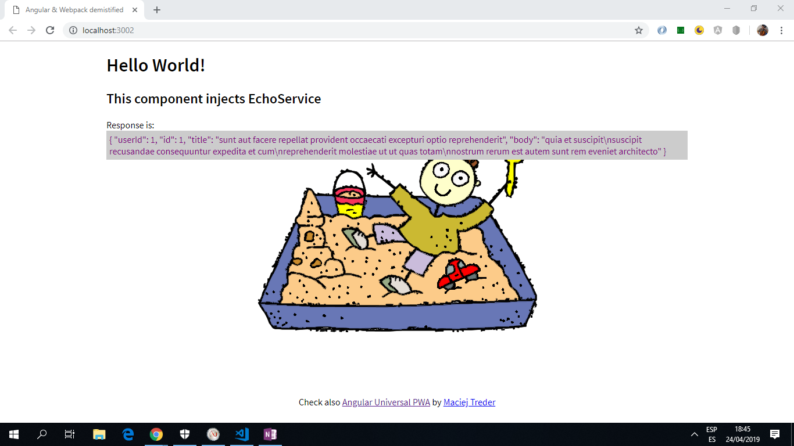

# Angular WebPack SPA Example

* Single Page App to make calls to an external API. Built with Angular & bundled using Webpack. Includes a node.js server.

*** Note: to open web links in a new window use: _ctrl+click on link_**

## Table of contents

* [General info](#general-info)
* [Screenshots](#screenshots)
* [Technologies](#technologies)
* [Setup](#setup)
* [Features](#features)
* [Status](#status)
* [Inspiration](#inspiration)
* [Contact](#contact)

## General info

* More about webpack:

1. Webpack is a module bundler, but you can also use it running tasks as well.

2. Webpack relies on a dependency graph underneath. Webpack traverses through the source to construct the graph, and it uses this information and configuration to generate bundles.

3. Webpack relies on loaders and plugins. Loaders operate on a module level, while plugins rely on hooks provided by webpack and have the best access to its execution process.

4. Webpack’s configuration describes how to transform assets of the graphs and what kind of output it should generate. Part of this information can be included in the source itself if features like code splitting are used.

5. Hot Module Replacement (HMR) helped to popularize webpack. It's a feature that can enhance the development experience by updating code in the browser without needing a full page refresh.

6. Webpack can generate hashes for filenames allowing you to invalidate past bundles as their contents change.

## Screenshots

.

## Technologies

* [Angular v7.2.14](https://angular.io/) & [Angular CLI v7.3.8](https://cli.angular.io/).

* [RxJS Library v6.5.1](https://angular.io/guide/rx-library) and makeCall() function used to consume API data [observable](http://reactivex.io/documentation/observable.html).

* [Webpack v4.30.0](https://webpack.js.org/) is used to bundle scripts.

* [Node.js v10.15.3](https://nodejs.org/es/)

* [Express v4.16.4](https://expressjs.com/)used to host app, including [Express methods](https://expressjs.com/en/4x/api.html#express.static)

* [ejs v2.6.1](https://ejs.co/) embedded javascript template engine.

## Setup

Already compiled using `npm run build`. Run app using `npm start` then navigate to `http://localhost:3000/`. Thsi starts the compiled build file.

## Code Examples

* the server.js file, as Node.js is used to host the app.

```javascript
const express = require('express');

const port = 3000 || process.env.PORT;
const app = express();

// use ejs javascript templating to render data.
app.engine('html', require('ejs').renderFile);

// render html on the server
app.set('view engine', 'html');
app.set('views', 'dist');

// use express to serve static file 'dist' (index set to false to disable directoy indexing to default 'index.html')
app.use('/', express.static('dist', { index: false }));

// retrieve all (*) data from the server to render on the index page
app.get('/*', (req, res) => {
   res.render('./index', {req, res});
});

// app to listen for requests on port defined already
app.listen(port, () => {
   console.log(`Listening on: http://localhost:${port}`);
});

```

## Features

* src/index.html used to host the Single Page App.

* Webpack used to bundle code, instead of angular CLI, hence the need for a webpack.config.js file.

* updated to the latest version of Angular 7. Dependencies updated with 0 dependency vulnerabilities.

* simple angular pipes used to display asynchronous json data: `{{response | async | json}}`.

## Status & To-Do List

* Status: Simple working app that runs the existing build file. Running `npm run build` just creates an error and does not renew the build file so no changes are included in a new build file.

* To-Do: add commenting and fix this issue of not compiling.

## Inspiration

* [Twilio Blog: Building an App from Scratch with Angular and Webpack](https://www.twilio.com/blog/2018/03/building-an-app-from-scratch-with-angular-and-webpack.html)

## Contact

Created by [ABateman](https://www.andrewbateman.org) - feel free to contact me!
